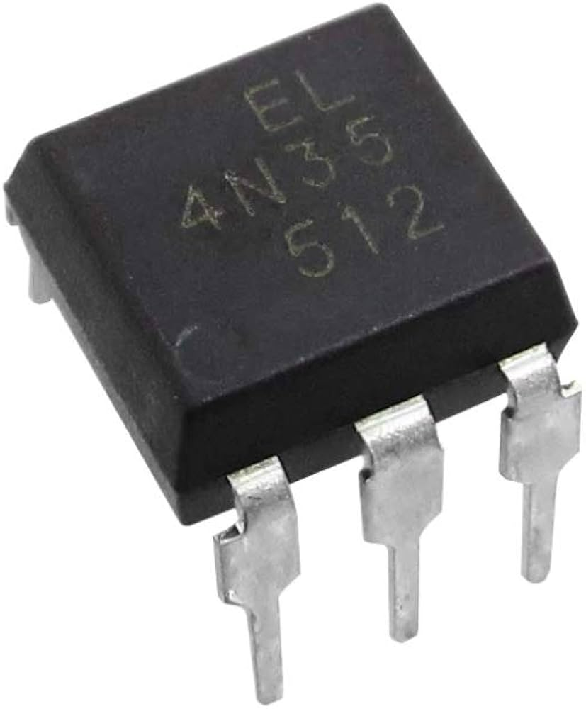
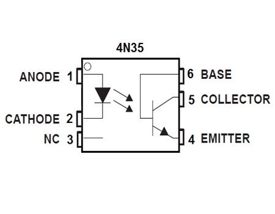

# Lección 11: Optoacopladores (con 4N35)

## Objetivos

- Comprender el funcionamiento de un **optoacoplador** como aislador galvánico.
- Conocer las prestaciones del **4N35**, sus pines y características.
- Aprender a usar optoacopladores para **aislamiento eléctrico**, protección y transmisión de señales.
- Construir circuitos prácticos con ejemplos de complejidad progresiva, incluyendo diagramas esquemáticos.

---

## Conceptos Clave

### ¿Qué es un Optoacoplador?


Un **optoacoplador** (o **fotocoplador**) es un componente que **transmite señales eléctricas mediante luz**, logrando **aislamiento galvánico** entre dos circuitos. Consta de:

- **LED infrarrojo** (emisor).
- **Fototransistor** o **fotodiodo** (receptor).
- Ambos encapsulados en un chip, sin conexión eléctrica directa.

> **Aislamiento galvánico**: No hay continuidad eléctrica entre entrada y salida → protege contra picos de voltaje, ruido y diferencias de tierra.

---

### 4N35: Características y Pinout (DIP-6)

|Pin|Nombre|Función|
|---|---|---|
|1|**Ánodo LED**|+ del LED|
|2|**Cátodo LED**|- del LED|
|4|**Emisor**|Emisor del fototransistor|
|5|**Colector**|Colector del fototransistor|
|3,6|**NC**|No conectado|



> **Nota**: El pin 3 y 6 no se usan. El fototransistor es **NPN**.

#### Prestaciones del 4N35

|Parámetro|Valor típico|
|---|---|
|Voltaje de aislamiento|5000 V RMS|
|Corriente LED (If)|60 mA máx|
|Voltaje LED (Vf)|~1.2 V|
|CTR (Current Transfer Ratio)|100% (mín)|
|Tiempo de respuesta|~5 µs|
|Temperatura operación|-55°C a +100°C|

> **CTR = Ic / If**: Relación entre corriente de salida y entrada. Ej: If = 5mA → Ic ≈ 5mA.

---

## Utilidad del 4N35

|Aplicación|Beneficio del aislamiento|
|---|---|
|Control de **relés** o **triacs**|Protege microcontrolador de 220V|
|Interfaz con **motores**|Evita ruido de retorno|
|Comunicación **RS232/RS485**|Aislamiento entre dispositivos|
|Circuitos de **alta tensión**|Seguridad y protección|
|Mediciones en **fuentes conmutadas**|Evita bucles de tierra|

---

## Componentes Necesarios

- 1 x **4N35** (optoacoplador).
- Resistencias: 220Ω, 1kΩ, 10kΩ.
- 1 x **LED** (indicador).
- 1 x **Raspberry Pi Pico** o Arduino.
- Fuente 5V y 12V (separadas).
- Protoboard, cables.

---

## Actividad Práctica 1: Prueba Básica (LED Controlado por LED)

**Objetivo**: Encender un LED en el lado aislado usando un LED en el lado de control.

1. **Conexión**:
    
    - Lado emisor: Ánodo (pin 1) → 5V a través de 1kΩ, Cátodo (pin 2) → GND.
    - Lado receptor: Colector (pin 5) → 5V a través de LED + 220Ω, Emisor (pin 4) → GND.
2. **Diagrama Esquemático**:
    
    ```
    +5V ----[R 1kΩ]---- (1) Ánodo LED
                        |
                      [4N35]
                        |
    GND --------------- (2) Cátodo LED
    
    +5V ----[R 220Ω]---[LED]--- (5) Colector
                                  |
                                [4N35]
                                  |
    GND ----------------------- (4) Emisor
    ```
    
3. **Prueba**:
    
    - Al alimentar el lado emisor → LED receptor se enciende.
    - **Sin conexión eléctrica** entre circuitos.

---

## Actividad Práctica 2: Control desde Microcontrolador (Señal Digital)

**Objetivo**: Usar un GPIO de la Pico para controlar un LED aislado.

1. **Conexión**:
    
    - Ánodo (pin 1) → GPIO (GP0) a través de 220Ω.
    - Cátodo (pin 2) → GND.
    - Colector (pin 5) → 12V a través de LED + 1kΩ.
    - Emisor (pin 4) → GND (común con 12V).
2. **Diagrama Esquemático**:
    
    ```
    GP0 (Pico) ---[R 220Ω]--- (1) 4N35
                              |
    GND ------------------- (2)
    
    +12V ----[R 1kΩ]---[LED]--- (5) 4N35
                                 |
    GND ------------------------ (4)
    ```
    
3. **Código MicroPython**:
    
    ```python
    from machine import Pin
    from time import sleep
    
    led_control = Pin(0, Pin.OUT)
    
    while True:
        led_control.value(1)
        sleep(0.5)
        led_control.value(0)
        sleep(0.5)
    ```
    
4. **Prueba**:
    
    - LED parpadea a 1Hz, con **12V aislado** del 3.3V de la Pico.

---

## Actividad Práctica 3: Control de Relé con Aislamiento

**Objetivo**: Activar un relé de 5V desde la Pico, con aislamiento.

1. **Conexión**:
    
    - Lado emisor: igual que antes (GPIO + 220Ω).
    - Lado receptor: Colector → bobina del relé (con diodo 1N4148 en paralelo), Emisor → GND.
    - Relé alimentado por 5V externo.
2. **Diagrama Esquemático**:
    
    ```
    GP0 ----[R 220Ω]---- (1) 4N35
                         |
    GND --------------- (2)
    
    +5V ----[Relé + Diodo]---- (5) 4N35
                                |
    GND ---------------------- (4)
    ```
    
3. **Prueba**:
    
    - Al activar GPIO → relé cierra contacto.
    - **Seguro**: 220V en contactos del relé, 3.3V en Pico.

---

## Actividad Práctica 4: Transmisión de Señal Analógica (con Modificación)

**Objetivo**: Transmitir una señal variable (potenciómetro) a través del optoacoplador.

> **Nota**: El 4N35 es **lineal solo en rango limitado**. Mejor usar **PC817** o **IL300** para linealidad.

1. **Conexión**:
    
    - Lado emisor: Potenciómetro (0-5V) → 1kΩ → LED.
    - Lado receptor: Colector → 12V a través de 10kΩ, Emisor → GND.
    - Salida: Voltaje en colector (inverso).
2. **Diagrama Esquemático**:
    
    ```
    Pot (0-5V) ---[R 1kΩ]--- (1) 4N35
                             |
    GND ------------------ (2)
    
    +12V ----[R 10kΩ]--------o Vout
                              |
                            (5) 4N35
                              |
    GND ------------------- (4)
    ```
    
3. **Prueba**:
    
    - Gira potenciómetro → Vout varía (no lineal, pero detectable).
    - Útil para **detección de umbral**, no medición precisa.

---

## Tarea

- Añade **pull-up** en el colector para mejor respuesta.
- Usa **dos 4N35** para transmitir señales bidireccionales.
- Controla un **triac** para lámpara 220V (con MOC3021, no 4N35).
- Mide **CTR** con multímetro: If = 5mA → Ic ≈ ?
- Simula en **Tinkercad**.

---

## Limitaciones del 4N35

|Problema|Solución|
|---|---|
|No lineal|Usar opto lineal (IL300)|
|Velocidad lenta (~5µs)|Usar 6N137 para alta velocidad|
|CTR varía con temperatura|Compensar en software|
|Corriente LED limitada|No exceder 60mA|

---

## Alternativas Comunes

|Modelo|Tipo|Uso|
|---|---|---|
|**PC817**|Fototransistor|General|
|**6N137**|Lógico (alta vel.)|Digital rápido|
|**MOC3021**|Triac driver|Control AC|
|**TLP521**|Fototransistor|Bajo costo|

---

## Conclusión

El **4N35** es un **aislador galvánico económico y robusto**, ideal para:

- Proteger microcontroladores.
- Interfaz con circuitos de potencia.
- Eliminar bucles de tierra.

Con este componente, puedes **controlar 220V desde 3.3V con total seguridad**.

---

## Próximos Pasos

Integrar optoacopladores en proyectos con:

- Control de **lámparas AC** (con triac).
- **Lectura de sensores de alta tensión**.
- **Comunicación aislada I2C/SPI**.